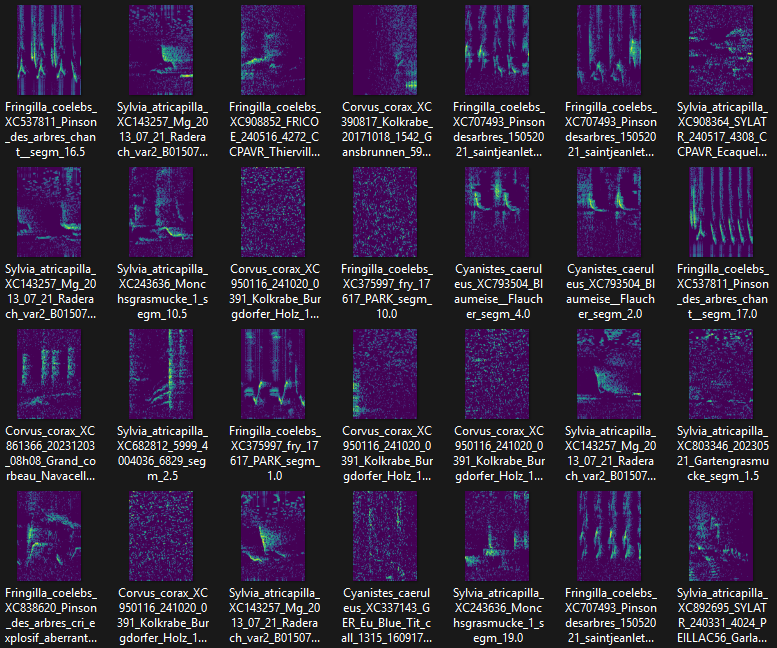

# Xeno-Canto organizer

**A python tool to prepare Xeno-Canto audio files for machine learning projects**

* Xeno-Canto (XC) (https://www.xeno-canto.org) is a data treasure for ecological, behavioral and acoustical applications. 
* However, the raw mp3 files cannot be directly used for machine learning (ML) because they first need to be prepared. 
* This tool allows to download, prepare and organize XC data in a structured repository tree that can be directly accessed by ML processes.
* It includes data segmentation and feature extraction as spectrograms
* :construction: The tool is still under development :construction:

## Features
* Check summaries before actual download
* Explicit selection of mp3 duration, quality, country, species gives fine control of what is included
* Also stores the XC meta-data in PKL files that are easy to integrate with python
* Spectrogram parameters can be flexibly adjusted, eg. short or long spectrograms can be taken, FFT params can be set
* Spectrogram are stored as PNG images which allows easy exploration and swift integration with established CNNs
* Original file name (mp3) is used as stub in all other files (wav and png) for traceability

## Usage
1. Make sure **ffmpg** and the Python packages are installed (see Dependencies and installation)
2. Check **config.yaml** that the url to XC API is still valid
3. Open **main.py** and run line-by-line at first to adjust the parameters
4. Once **main.py** is ready, run **main.py**
5. Result: metadata, mp3, wav, and spectrograms should be ready in their respective directories
6. :satisfied: :smirk: Now you can throw your PyTorch magics at those PNGs (not covered in this codebase :wink:) 

Example of how preparation of data for an ML project can be handled with super-short Python script
```python
# Import xco module
import xco 
# Make an instance of the XCO class and define the start path 
xc = xco.XCO(start_path = '<path to the project dir>')
# Create a template json parameter file (to be edited)
xc.make_param(filename = 'download_criteria.json')
# Get information of what would be downloaded
xc.get(params_json = 'download_criteria.json', download = False)
# Download mp3 files with metadata  
xc.get(params_json = 'download_criteria.json', download = True)
# Convert mp3s to wav with a specific sampling rate (requires ffmpeg to be installed)
xc.mp3_to_wav(target_fs = 24000)
# Extract spectrograms of fixed-length segments and store as PNGs
xc.extract_spectrograms(target_sampl_freq = 24000, duratSec = 0.5, win_siz = 256, win_olap = 128, seg_step_size = 0.5)
```

## Illustration
* The figure below is a snapshot of a few spectrograms obtained with this tool.
* Note that this is an illustration with some particular parameter values:
    * Mp3 were converted to wav files with fs=24000
    * Wav files were cut into short pieces of 0.5 seconds and spectrograms extracted via short time Fourier transform (STFT)
    * In this example, STFT window had 256 bins (Hamming) with 128 bins overlap
    * Spectrograms were equalized (maad.sound.median_equalizer), log10 transformed and mapped to [0, 255]
    * This gave small images with constant dimension of 92 time bins x 129 frequency bins
    * Original filename and position in original wav file is tracked in the image filename
    * For each file the XC metadata is tracked in **downloaded_data_meta.pkl**

  

## Why save spectrogram of sounds as PNG images ?
* Yes, for people working in acoustics this is a bit irritating
* However, it is handy because many PyTorch models and data augmentation procedures can directly ingest PNGs
* However, it is handy because images can be easily visualized with standard software
* Export as binary numpy files is planned but not yet available.

## Dependencies and installation
* This code will download data from the XC API https://www.xeno-canto.org/api/2/recordings
* Developed under Python 3.12.8
* Install **ffmpg** (see for example https://ffmpeg.org)
* Make a fresh venv and install the python packages 
```
pip install -r requirements.txt
```

## Useful links
* https://creativecommons.org/licenses/
* https://xeno-canto.org/explore/api


