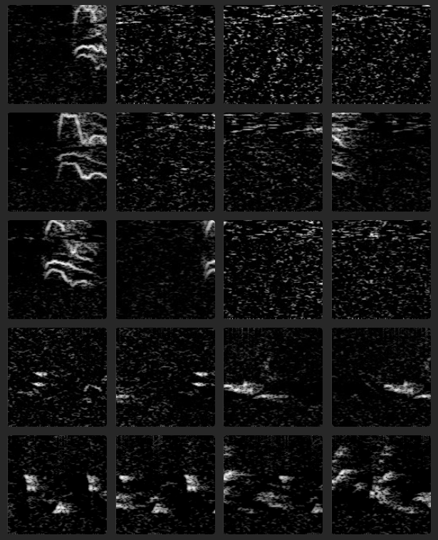
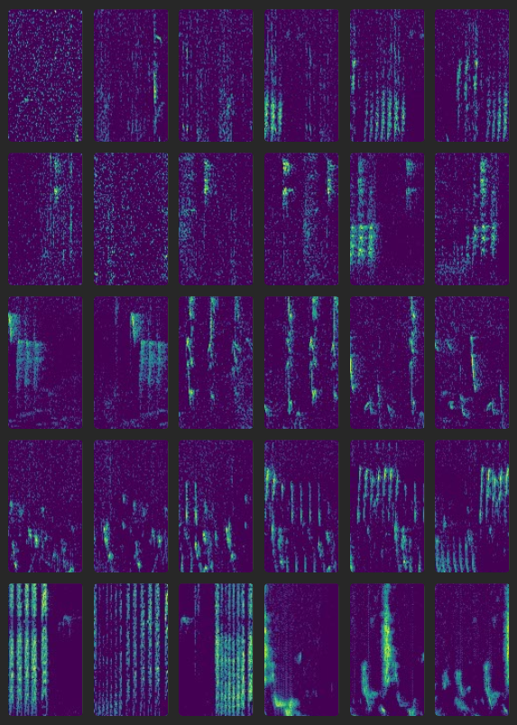
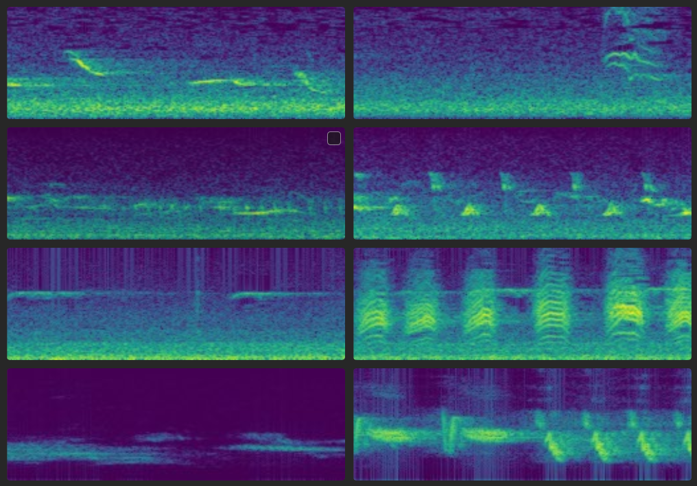

# Xeno-Canto organizer 

**A python tool to prepare Xeno-Canto audio files for machine learning projects**
* :construction:  Still under development :construction:
* Xeno-Canto (XC) (https://www.xeno-canto.org) is a data treasure for ecological and acoustical applications. 
* However, the raw mp3 files cannot be directly used by machine learning (ML) processes. 
* This tool allows to download, prepare and organize XC data such that it can be readily used by ML processes.
* It includes data segmentation and feature extraction as spectrograms

## Features
* Check summaries before actual download
* Explicit selection of mp3 duration, quality, country, species gives fine control of what is included
* Also stores the XC meta-data in PKL files that are easy to integrate with Python
* Spectrogram parameters can be flexibly adjusted, eg. short or long spectrograms can be taken, FFT params can be set
* Spectrogram are stored as PNG images which allows easy exploration and swift integration with established CNNs

## Usage
1. Make sure **ffmpg** and the Python packages are installed (see Dependencies and installation)
2. Check **config.yaml** that the url to XC API is still valid
3. Open **main.py** and run line-by-line at first to adjust the parameters
4. Once **main.py** is ready, run the complete **main.py** 
5. Result: metadata, mp3, wav, and spectrograms should be ready in their respective directories
6. :satisfied: :smirk: Now you can throw your PyTorch magics at those PNGs (not covered in this codebase :wink:) 


## Sample code
Example of how preparation of data for an ML project can be handled with super-short Python script
```python

#----------------------
# minimalistic example
import xco 
# Make an instance of the XCO class and define the start path 
xc = xco.XCO(start_path = 'C:/<path where data will be stored>')
# Create a template json parameter file (to be edited)
xc.make_param(filename = 'download_criteria.json', template = "mini")
# Get information of what will be downloaded
df_records = xc.get_summary(params_json = 'download_criteria.json')
# make summaries  
print(df_records.shape)
# Download the files 
xc.download(df_recs = df_records)
# Convert mp3s to wav with a specific sampling rate (requires ffmpeg to be installed)
xc.mp3_to_wav(target_fs = 20000)
# Extract spectrograms of fixed-length segments and store as PNG
xc.extract_spectrograms(target_fs = 20000, segm_duration = 1.0, segm_step = 0.5, win_siz = 512, win_olap = 192, equalize = False, colormap='viridis')
```

## Illustration
* The figure below is a snapshot of a few spectrograms obtained with this tool.
    * Mp3 were converted to wav files with fs=24000
    * Wav files were cut into short pieces of 1.0 seconds and spectrograms extracted via short time Fourier transform (STFT)
    * In this example, STFT window had 256 bins (Hamming) with 128 bins overlap
    * Spectrograms were equalized (optional, see appendix 2), log10 transformed and mapped to [0, 255]
    * They can be exported as 1-channel images (here) or 3-channel color images (appendix 1)

  

## Why save spectrogram of sounds as PNG images ?
* Yes, for people working in acoustics this is a bit irritating
* It is handy because many PyTorch models and data augmentation procedures can directly ingest PNGs
* It is handy because images can be easily visualized with standard software
* Export as binary numpy files is planned but not yet available.

## Dependencies and installation
* This code will download data from the XC API https://www.xeno-canto.org/api/2/recordings
* Developed under Python 3.12.8
* Install **ffmpg** (see for example https://ffmpeg.org)
* Make a fresh venv and install the python packages 
```
pip install -r requirements.txt
```

## Useful links
* https://creativecommons.org/licenses/
* https://xeno-canto.org/explore/api


## Limitation
* Apparently, only 1 country and 1 species per request allowed by XC API
* Only 1 request per second allowed by XC API


## Appendix 1

It is also possible to extract 3-channel RGB images, e.g to be directly ingested by Image CNNs such as ResNet, EfficintNet an co

  


## Appendix 2

It is also possible to suppress equalization. 
However, the high-pass filters or the low-freq ambient noise will often be dominant.

  


## A


